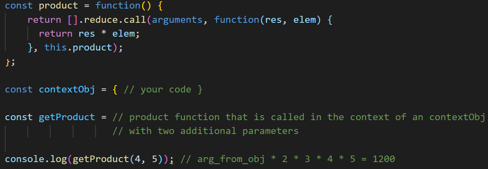

# Task 1

Create a Movie class, the constructor of which accepts 3 parameters: movie name name, movie genre category and start year of startShow.

The class has a watchMovie() method that returns a phrase and adds a movie name name parameter to it at the end. For example, "I watch the movie Titanic!"

Create an instance of the movie1 class with the title of the movie "Titanic", the genre "drama" and 1997 release.

Create an instance of the movie2 class with the title of the movie "Troya", the genre "historical" and the 2004 release.

Code:

```js
const Checker = require("./Checker.js");

class Movie {
  constructor(name, category, startShow) {
    this.name = name;
    this.category = category;
    this.startShow = startShow;
  }
  watchMovie() {
    return `I watch the movie ${this.name}!`;
  }
}
movie1 = new Movie("Titanic", "drama", 1997);
movie2 = new Movie("Troya", "historical", 2004);
```

# Task 2

Implement the Student class, the constructor of which accepts 2 parameters fullName - the name and surname of the student, direction - the direction in which he studies.

Create a showFullName() method that returns the student's first and last name.

Create a nameIncludes(data) method that, using the showFullName() method, checks for the text data argument in the student’s name and returns true if a match is found or false if not found.

Create a static studentBuilder() method that returns a new instance of the class named ‘Ihor Kohut’ and the direction ‘qc’.

Create a getter and setter direction() to read and specify the direction field.

Create an instance of class stud1 named 'Ivan Petrenko' and direction 'web'.

Create an instance of class stud2 named 'Sergiy Koval' and direction 'python'.

Create an instance of the stud3 class named ‘Ihor Kohut’ and the direction ‘qc’ using the static studentBuilder() method.

Usage example:

```js
const stud1 = new Student("Ivan Petrenko", "web");

stud1.nameIncludes("Ivan"); // true

stud1.nameIncludes("Denysenko"); // false
```

Code:

```js
const Checker = require("./Checker.js");

class Student {
  constructor(fullName, direction) {
    this._fullName = fullName;
    this._direction = direction;
  }
  showFullName() {
    return this._fullName;
  }
  nameIncludes(data) {
    return this.showFullName().includes(data);
  }
  get direction() {
    return this._direction;
  }
  set direction(direction) {
    this._direction = direction;
  }
  static studentBuilder() {
    return new Student("Ihor Kohut", "qc");
  }
}

const stud1 = new Student("Ivan Petrenko", "web");
const stud2 = new Student("Sergiy Koval", "python");
const stud3 = Student.studentBuilder();
```

# Task 3

Product constructor should provide a generation of unique product id within the application no matter how many products are created.

Distributor can store information about products in its products property and has an ability to add and remove a product.

addProduct adds a new property to products with name of product id and value - product name.

removeProduct removes a property with specified id from products

Please, use Symbol data type.

Code:

```js
class Distributor {
  constructor() {
    this.products = {};
  }

  addProduct(id, name) {
    this.products[id] = name;
  }

  removeProduct(id) {
    delete this.products[id];
  }
}

const localDistributor = new Distributor();
const localDistributor2 = new Distributor();

class MyProduct {
  constructor(name) {
    this.id = Symbol(name);
    this.name = name;
  }

  distribute(distributor) {
    distributor.addProduct(this.id, this.name);
  }
}
```

# Task 4

Implement the getMin(arr) function, which takes an array of numbers arr and returns the smallest number of the array. To solve the problem, you must use one of the methods to specify the context of this. It is forbidden to use any cycles.

Code:

```js
function getMin(arr) {
  return Math.min.apply(this, arr);
}
```

# Task 5

We have the product() function, you can see it on the snapshot below. This product() function finds the product of its arguments and also uses this object for the initial value of the product.

Please, create a new function getProduct() that, no matter how it is called, will be always bound to a particular this value. getProduct() should be created from the original product() function and work with the same logic, but should pass two additional arguments – 2 and 3 – to the original function, every time getProduct() is called.

Object this for getProduct() function you should also define by yourself. Look at snapshot for clues what it should be.



Code:

```js
const product = function () {
  return [].reduce.call(
    arguments,
    function (res, elem) {
      return res * elem;
    },
    this.product
  );
};

const contextObj = {
  product: 10,
};

const getProduct = product.bind(contextObj, 2, 3);
```

# Task 6

Implement the Plane class, the constructor of which accepts 3 parameters model - model of the plane, fuelSupply - capacity of a stock of fuel of the plane, fuelConsumption - average fuel consumption in liters on 100 km of flight.

Create a method of class calcFlightRange(), which determines the range of the plane by the formula fuelSupply / fuelConsumption \* 100 and returns it.

Create a static method of class sortFlightRange(planesArray), which takes an array of instances of class planesArray, sorts the flight range of plane in ascending order and outputs the result to the console in the format plane_model: range.

Create a TransportPlane class, which is inherited from the Plane class, the constructor of which takes 5 parameters model - plane model, fuelSupply - the amount of fuel, fuelConsumption - the average fuel consumption in liters per 100 km, cargo - maximum tonnage, addTank - about additional tanks of the plane In this class, you need to override the calcFlightRange() method to take into account that the fuelSupply has increased the amount of fuel added by the addTank.

Create a class PassengerPlane, which is inherited from the class Plane, whose constructor accepts 5 parameters model, fuelSupply, fuelConsumption, passengers - the maximum number of passengers, refueling - the amount of additional fuel received in the refueling. In this class, you need to override the calcFlightRange() method to take into account that the fuelSupply has increased refueling.

Create a WarPlane class, which is inherited from the Plane class, the constructor of which accepts 5 parameters model, fuelSupply, fuelConsumption, missiles - the number of missile weapons, aerodynamicsKoef - the coefficient of aerodynamics of the plane. In this class, you need to override the calcFlightRange() method in such a way as to take into account that the flight range of the plane increases in proportion to the value of the aerodynamics coefficient of aerodynamicsKoef.

Usage example:

```js
console.log("Unsorted range of planes:");

const plane1 = new TransportPlane("An-225 Mriya", 105000, 5000, 500, 300000);

console.log("An-225 Mriya: ", plane1.calcFlightRange());

const plane2 = new PassengerPlane("Boeing-747", 193000, 2500, 410, 90000);

console.log("Boeing-747:", plane2.calcFlightRange());

const plane3 = new WarPlane("F-22 Raptor", 8200, 320, 20, 1.2);

console.log("F-22 Raptor:", plane3.calcFlightRange());

console.log("Sorted range of planes:");

const planesArray = [plane1, plane2, plane3];

Plane.sortFlightRange(planesArray);
```

Output in console:

```
Unsorted range of planes:

An-225 Mriya:  8100

Boeing-747:  11320

F-22 Raptor:  3075

Sorted range of planes:

F-22 Raptor: 3075

An-225 Mriya: 8100

Boeing-747: 11320
```

Code:

```js
class Plane {
  constructor(model, fuelSupply, fuelConsumption) {
    this.model = model;
    this.fuelSupply = fuelSupply;
    this.fuelConsumption = fuelConsumption;
  }
  calcFlightRange() {
    return (this.fuelSupply / this.fuelConsumption) * 100;
  }
  static sortFlightRange(planesArray) {
    planesArray.sort((a, b) => a.calcFlightRange() - b.calcFlightRange());
    planesArray.forEach((el) => {
      console.log(`${el.model}: ${el.calcFlightRange()}`);
    });
  }
}

class TransportPlane extends Plane {
  constructor(model, fuelSupply, fuelConsumption, cargo, addTank) {
    super(model, fuelSupply, fuelConsumption);
    this.cargo = cargo;
    this.addTank = addTank;

    this.fuelSupply += this.addTank;
  }
  calcFlightRange() {
    return super.calcFlightRange();
  }
}

class PassengerPlane extends Plane {
  constructor(model, fuelSupply, fuelConsumption, passengers, refueling) {
    super(model, fuelSupply, fuelConsumption);
    this.passengers = passengers;
    this.refueling = refueling;

    this.fuelSupply += this.refueling;
  }
  calcFlightRange() {
    return super.calcFlightRange();
  }
}

class WarPlane extends Plane {
  constructor(model, fuelSupply, fuelConsumption, missiles, aerodynamicsKoef) {
    super(model, fuelSupply, fuelConsumption);
    this.missiles = missiles;
    this.aerodynamicsKoef = aerodynamicsKoef;

    this.fuelSupply *= this.aerodynamicsKoef;
  }
  calcFlightRange() {
    return super.calcFlightRange();
  }
}
```

# Task 7

Implement the PizzaMaker class, which allows you to create pizza of different types, with different ingredients, calculate the price and calorie content of pizza.

The pizza comes in 3 sizes: S, M and L.

There are 4 types of pizza available: meat, fish, cheese and vegetarian.

When creating a new pizza, be sure to specify the size and appearance.

Additional ingredients are available that can be added to the pizza at the customer's request: tomatoes, peppers, bacon and olives.

Each element that makes up pizza has its own name, price and calorie content. All of this data is contained in the pizzaMenu object.

The PizzaMaker class has a number of methods for generating pizza:

- addIngredient(ingredient) method adds an additional ingredient to the pizza. A new ingredient is added if it is not included in the pizza, and the message "ingredient_name has been added" is displayed in the console. If such an ingredient has already been added, the message "Such an ingredient already exists!" Is generated.

- deleteIngredient(ingredient) method removes the specified ingredient from the list of existing ingredients, displays the message "ingredient_name has been deleted" to the console.

- getIngredients() method returns a list of the attached ingredients with their name, price, calorie content.

- getSize() method returns the size of the pizza.

- getKind() method returns the type of pizza.

- calculatePrice() method calculates and returns the total cost of a pizza, which consists of the sum of the values ​​of all its components.

- calculateCalories() method calculates and returns the total calorie content of a pizza, which consists of the sum of the calories of all its components.

Usage example:

```js
const pizzaMenu = {
  SIZE_S: { param: "SIZE_S", price: 60, calorie: 300 },
  SIZE_M: { param: "SIZE_M", price: 90, calorie: 450 },
  SIZE_L: { param: "SIZE_L", price: 110, calorie: 600 },
  KIND_MEAT: { param: "KIND_MEAT", price: 55, calorie: 230 },
  KIND_FISH: { param: "KIND_FISH", price: 70, calorie: 150 },
  KIND_CHEESE: { param: "KIND_CHEESE", price: 50, calorie: 200 },
  KIND_VEGETARIAN: { param: "KIND_VEGETARIAN", price: 35, calorie: 50 },
  INGREDIENT_TOMATOES: { param: "INGREDIENT_TOMATOES", price: 15, calorie: 5 },
  INGREDIENT_PEPPER: { param: "INGREDIENT_PEPPER", price: 18, calorie: 5 },
  INGREDIENT_BACON: { param: "INGREDIENT_BACON", price: 25, calorie: 40 },
  INGREDIENT_OLIVES: { param: "INGREDIENT_OLIVES", price: 20, calorie: 0 },
};

// your PizzaMaker class implementation

const pizza = new PizzaMaker(pizzaMenu.SIZE_M, pizzaMenu.KIND_MEAT);

console.log("Size:", pizza.getSize());

console.log("Kind:", pizza.getKind());

console.log("calculatePrice:", pizza.calculatePrice());

console.log("calculateCalories:", pizza.calculateCalories());

console.log("getIngredients:", pizza.getIngredients());

pizza.addIngredient(pizzaMenu.INGREDIENT_TOMATOES);

pizza.addIngredient(pizzaMenu.INGREDIENT_BACON);

console.log("getIngredients:", pizza.getIngredients());

pizza.deleteIngredient(pizzaMenu.INGREDIENT_TOMATOES);

console.log("getIngredients:", pizza.getIngredients());

console.log("calculatePrice:", pizza.calculatePrice());

console.log("calculateCalories:", pizza.calculateCalories());
```

Output in console:

```
Size: SIZE_M

Kind: KIND_MEAT

calculatePrice: 145

calculateCalories: 680

getIngredients: []

INGREDIENT_TOMATOES has been added

INGREDIENT_BACON has been added

getIngredients: [

  { param: 'INGREDIENT_TOMATOES', price: 15, calorie: 5 },

  { param: 'INGREDIENT_BACON', price: 25, calorie: 40 }

]

INGREDIENT_TOMATOES has been deleted

getIngredients: [ { param: 'INGREDIENT_BACON', price: 25, calorie: 40 } ]

calculatePrice: 170

calculateCalories: 720
```

Code:

```js
const pizzaMenu = {
  SIZE_S: { param: "SIZE_S", price: 60, calorie: 300 },
  SIZE_M: { param: "SIZE_M", price: 90, calorie: 450 },
  SIZE_L: { param: "SIZE_L", price: 110, calorie: 600 },
  KIND_MEAT: { param: "KIND_MEAT", price: 55, calorie: 230 },
  KIND_FISH: { param: "KIND_FISH", price: 70, calorie: 150 },
  KIND_CHEESE: { param: "KIND_CHEESE", price: 50, calorie: 200 },
  KIND_VEGETARIAN: { param: "KIND_VEGETARIAN", price: 35, calorie: 50 },
  INGREDIENT_TOMATOES: { param: "INGREDIENT_TOMATOES", price: 15, calorie: 5 },
  INGREDIENT_PEPPER: { param: "INGREDIENT_PEPPER", price: 18, calorie: 5 },
  INGREDIENT_BACON: { param: "INGREDIENT_BACON", price: 25, calorie: 40 },
  INGREDIENT_OLIVES: { param: "INGREDIENT_OLIVES", price: 20, calorie: 0 },
};
class PizzaMaker {
  constructor(size, appearance) {
    this.size = size;
    this.appearance = appearance;
    this.ingredients = [];
  }
  addIngredient(ingredient) {
    if (this.ingredients.includes(ingredient))
      console.log("Such an ingredient already exists!");
    else {
      this.ingredients.push(ingredient);
      console.log(`${ingredient.param} has been added`);
    }
  }
  deleteIngredient(ingredient) {
    if (this.ingredients.includes(ingredient)) {
      this.ingredients = this.ingredients.filter((f) => f != ingredient);
      console.log(`${ingredient.param} has been deleted`);
    }
  }
  getIngredients() {
    return this.ingredients;
  }
  getSize() {
    return this.size.param;
  }
  getKind() {
    return this.appearance.param;
  }
  calculatePrice() {
    return (
      this.size.price +
      this.appearance.price +
      this.ingredients.reduce((acc, item) => acc + item.price, 0)
    );
  }
  calculateCalories() {
    return (
      this.size.calorie +
      this.appearance.calorie +
      this.ingredients.reduce((acc, item) => acc + item.calorie, 0)
    );
  }
}
```
