# Task 1

Implement the **getModifiedArray(array)** function, which takes an arbitrary array, and returns an array with the value of the first element of the array equal to “Start”, the last element of the array equal to “End” and the rest of elements should be the same as in an initial array. The initial array should stay unchanged.

Function example:

getModifiedArray([12, 6, 22, 0, -8])); // [‘Start’, 6, 22, 0, ‘End’]

Code:

```js function getModifiedArray(array) {
   const resArray = array.map((el,index)=> {
       if(index==0) return 'Start';
       if(index==array.length-1) return 'End';
       return el;
   })
   return resArray;
}
```

Result:

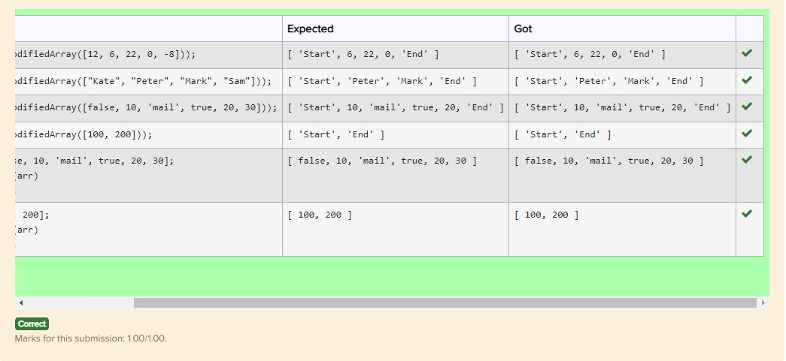

# Task 2

The function **filterByN** receives an array of integers, a number and a parameter (greater, less). Print a new array, where all elements will be greater/less than this number

By default, the number is 0, the parameter is greater.

Example:

filterNums([-1, 2, 4, 0, 55, -12, 3], 11, 'greater'); //[ 55]

filterNums([-2, 2, 3, 0, 43, -13, 6], 6, 'less'); // [-2, 2, 3, 0, -13]

filterNums([-2, 2, 3, 0, 43, -13, 6], -33, 'less'); // []

filterNums([-2, 2, 3, 0, 43, -13, 6]); // [2, 3, 43, 6]

filterNums([-2, 2, 3, 0, 43, -13, 6], 23); // [43]

Code:

```js
const filterNums = (array, number = 0, parameter = "greater") => {
  if (parameter === "greater") return array.filter((f) => f > number);
  return array.filter((f) => f < number);
};
```

Result:

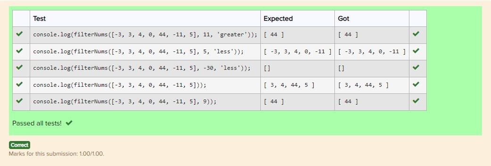

# Task 3

Find the **maximum** interval between two consecutive arguments.

Example:

maxInterv(3, 5, 2, 7); //5

maxInterv(3, 5, 2, 7, 11, 0, -2); //11

maxInterv(3, 5); //2

maxInterv(3); //0

Code:

```js
const maxInterv = (...arg) => {
  if (arg.length <= 1) return 0;
  let res = -100;
  [...arg].reduce((a, b) => {
    res = Math.max(res, Math.abs(a - b));
    return b;
  });
  return res;
};
```

Result:

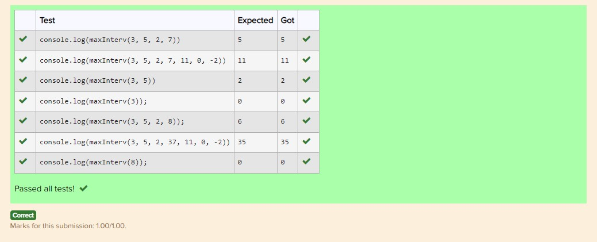

# Task 4

The function takes any number of strings and returns the sum of their lengths.

Example:

console.log(sumOfLen('hello', 'hi')); //7

console.log(sumOfLen('hi')); //2

console.log(sumOfLen()); //0

console.log(sumOfLen('hello', 'hi', 'my name', 'is')); //16

Code:

```js
const sumOfLen = (...arg) => {
  if (arg.length <= 0) return 0;
  return arg.reduce((sum, el) => {
    if (typeof sum == "string") sum = 0;
    return sum + el.length;
  }, arg[0]);
};
```

Result:

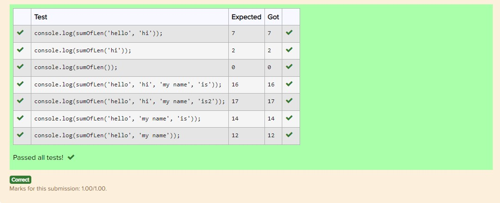

# Task 5

Write a function **combineArray(arr1, arr2)**, which takes 2 arrays, and returns a new array consisting only of numeric elements of arrays arr1 and arr2.

Function example:

combineArray([12, "User01", 22, true, -8], ["Index", 6, null, 15])); // [12, 22, -8, 6, 15]

Code:

```js
function combineArray(arr1, arr2) {
  return [
    ...arr1.filter((f) => typeof f == "number"),
    ...arr2.filter((f) => typeof f == "number"),
  ];
}
```

Result:

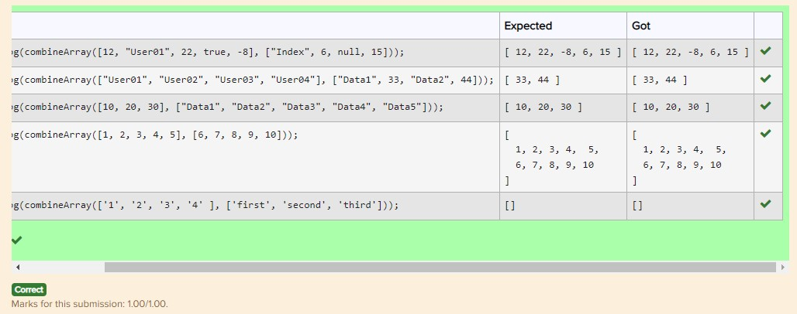

# Task 6

Implement the **longestLogin(loginList)** function, which takes an array of user logins loginList and returns the longest login. If the logins of the same length are the longest in the array, the login element with the largest index is returned. Tip: You can use the reduce() method to solve the task.

Function examples:

longestLogin(["serg22", "tester_2", "Prokopenko", "guest"]); // Prokopenko

longestLogin(["user1", "user2", "333", "user4", "aa"]); // user4

Code:

```js
function longestLogin(loginList) {
  return loginList.reduce((res, val) => {
    if (res.length > val.length) return res;
    else return val;
  });
}
```

Result:


# Task 7

Implement the **processArray(arr, factorial)** function, which takes the first parameter of the array arr, and the second parameter the function factorial and processes each element of the array arr with the function factorial, returning a new array (the source array arr does not change)

The function factorial(n) calculates and returns the factorial of the number n. For example factorial(4) returns 24.

Example

// determines the factorial of the number n

function factorial(n) { // your code};

processArray([1, 2, 3, 4, 5], factorial); // [1, 2, 6, 24, 120]

Code:

```js
function factorial(n) {
  if (n <= 1) return 1;
  return n * factorial(n - 1);
}

function processArray(arr, factorial) {
  return arr.map((el) => factorial(el));
}
```

Result:

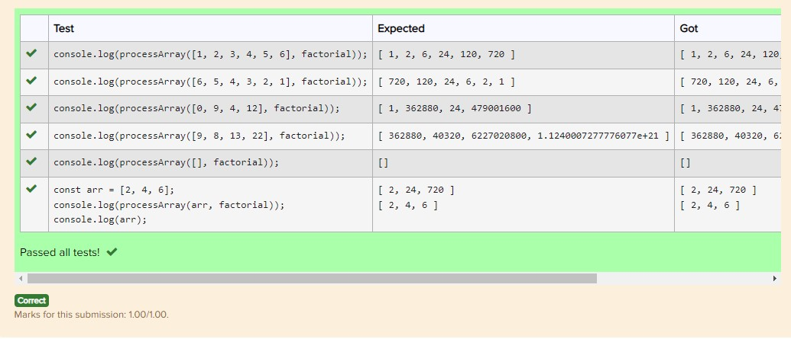

# Task 8

Using the default parameter technique, overload the **overloadedFunc()** function, which takes 3 arguments. For the 1st argument of the function set the default value [1, 2, 3], for the 2nd - the value 2, for the 3rd - the function that returns the product of the first two arguments, and the function can multiply both arrays and numbers.

The overloadedFunc() function returns the result of the default function.

Usage example:

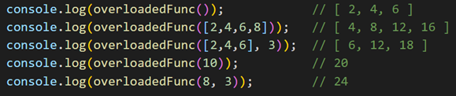

Code:

```js
const func = require("./Checker.js");

const multiply = (a, b) => {
  if (typeof a === "number" && typeof b === "number") return a * b;
  if (Array.isArray(a) && typeof b === "number") return a.map((el) => el * b);
};

function overloadedFunc(arg1 = [1, 2, 3], arg2 = 2, arg3 = multiply) {
  return arg3(arg1, arg2);
}
```

Result:

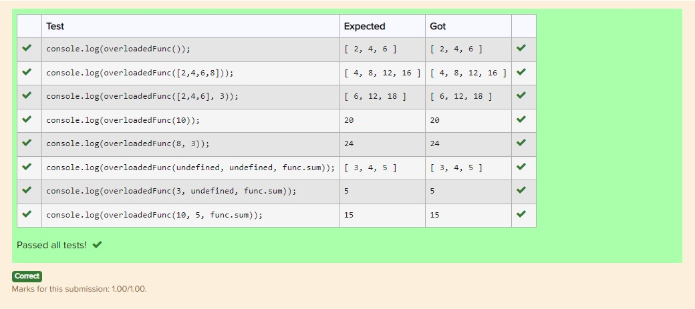

# Task 9

Please, implement a function combineFunctions that takes any number of functions as an argument and returns a function that is a composition of the arguments.

For example:

negate = function(x){ return -x; };

halve = function(x){ return x / 2; };

square = function(x){ return x \* x; };

double = function(x){ return 2 \* x; };

combineFunctions(negate, halve, square) should return a function

square(halve(negate(x)))

combineFunctions(negate, double) should return a function

double(negate(x)))

Code:

```js
const combineFunctions = (...func) => {
  return function (x) {
    let temp = x;
    let len = func.length;
    for (let i = 0; i < len; i++) temp = func[i](temp);
    return temp;
  };
};
```

Result:

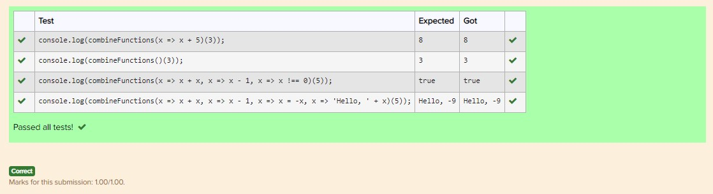

# Task 10

Suppose, you have an array of students:

```js
let students = [
  {
    name: "Anna",
    languages: ["English", "Ukrainian"],
    age: 21,
  },
  {
    name: "Bob",
    languages: ["Polish", "Spanish"],
    age: 26,
  },
  {
    name: "Alice",
    languages: ["Italian", "Russian"],
    age: 18,
  },
];
```

Please, implement a function getLanguages.

The function takes an array of students as a first parameter

and a condition on a student (function)

getLanguages should return an array of languages from students that satisfy a condition.

**For example:**

```js
getLanguages(students, student => student.age < 26) should return

['English', 'Ukrainian',  'Italian', 'Russian']
```

```js
getLanguages(students, student => student.name === 'Alice') should return

['Italian', 'Russian']
```

```js
getLanguages(students) should return

['English', 'Ukrainian','Polish', 'Spanish', 'Italian', 'Russian']
```

Try to use reduce and not use loops to solve this task.

Code:

```js
const getLanguages = (students, func = (f) => true) => {
  return [...students]
    .filter(func)
    .map((el) => el.languages)
    .reduce((left, right) => left.concat(right));
};
```

Result:

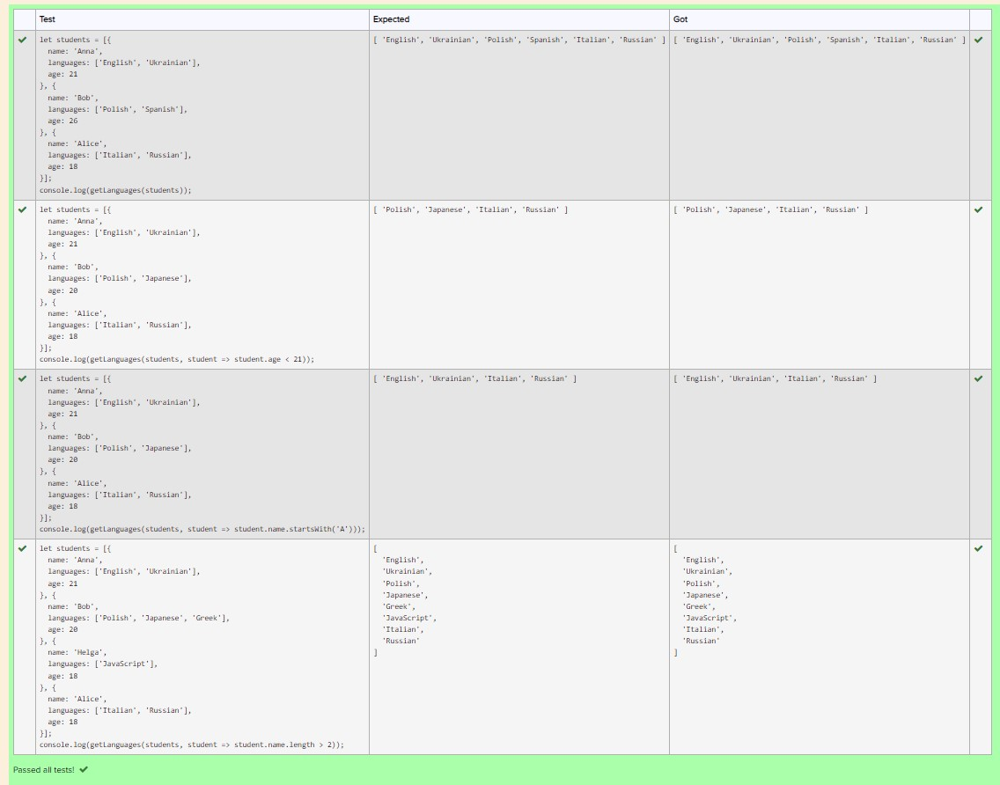

# Task 11

Implement 5 functions that take strings of data and process them in a certain way.

1. The upperCase() function takes string data as an argument and returns it to uppercase.

2. The tripleExclaim() function takes string data as an argument and returns it by adding three exclamation marks to it.

3. The split() function takes a separator as an argument, returns a function that accepts string data split by the separator character into an ordered set of substrings, and returns an array of those substrings.

4. The join() function takes separator as an argument, returns a function that takes an array of string data that are concatenated into a string by separator, and returns that string.

5. The copy() function takes string data as an argument and returns it repeating 2 times.

Implement the **createComposition()** function, which can take any number of functions as arguments, and create a composition from them. The **createComposition()** function takes our 5 functions as arguments. The **createComposition()** function returns a function that takes its initial value as an argument. This nested function successively passes through an array of functions with each iteration returning the result of calling the accumulated value of the current function argument. The reduce() method can be used here.

The final function result is assigned the function **createComposition()**, which takes our 5 functions as arguments in the appropriate order. (split with '\_' argument, join with ' ' argument)

Tips.

Consider that the result of one function can be passed as an argument to another function.

Pay attention to the order of the function arguments.

If you have difficulty implementing the createComposition() function, check out the "Useful links" for the material on function composition.

Usage example:

// implementation of 5 atomic functions

// implementation of createComposition function

```js
const result = createComposition( // 5 function-arguments )

console.log(result("by_ticket_now"));  //  BY TICKET NOW!!! BY TICKET NOW!!!
console.log(result("total sale")); //  TOTAL SALE!!! TOTAL SALE!!!
```

Code:

```js
const upperCase = (str) => str.toUpperCase();

const tripleExclaim = (str) => str + "!!!";

const split = (separator) =>
  function (str) {
    return str.split(separator);
  };
const join = (separator) =>
  function (arr) {
    return arr.join(separator);
  };

const copy = (str) => str + " " + str;

const createComposition = (...args) => {
  let len = args.length;
  return function (str) {
    let temp = str;
    for (let i = 0; i < len; i++) {
      temp = args[i](temp);
    }
    return temp;
  };
};

const result = createComposition(
  upperCase,
  tripleExclaim,
  split("_"),
  join(" "),
  copy
);
```

Result:

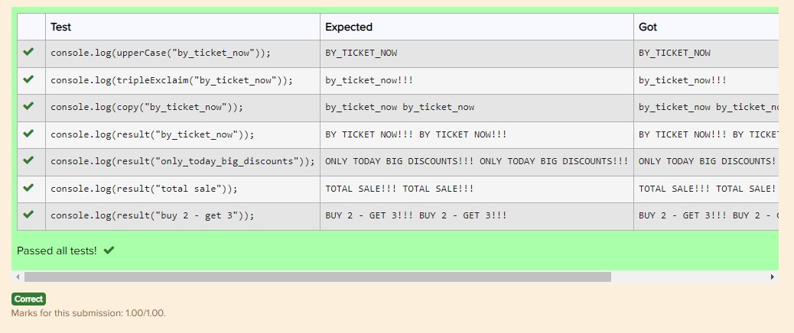
